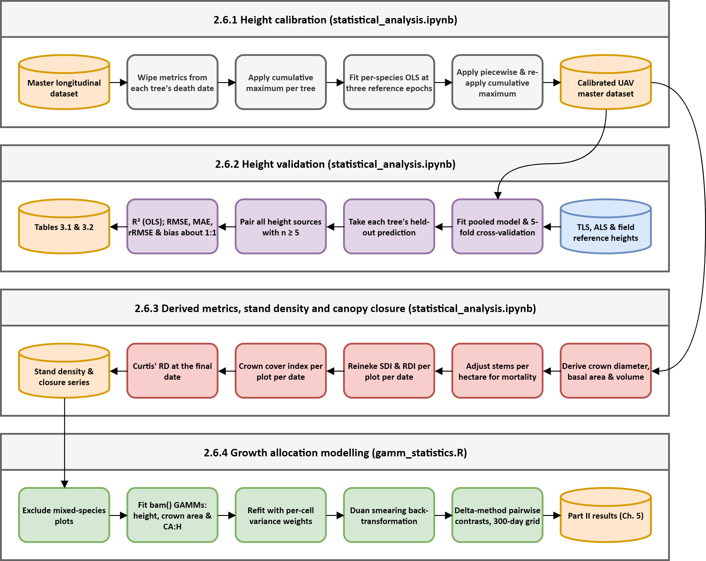

# EucVision — Python analysis

**Assessing weekly crown dynamics of juvenile *Eucalyptus* using high-resolution RGB UAV imagery**

Jacques Vermeulen · MSc Forestry, Stellenbosch University
IMPACT OAL trial, [eucxylo.sun.ac.za](https://eucxylo.sun.ac.za/)

---

## Overview

The R pipeline (`../R`) produces the master longitudinal dataset; this folder does the analysis on it. Two scripts are used in the thesis — the Colab analysis notebook and the Pix4D report extractor. The remaining scripts are exploratory groundwork on automated crown delineation and are retained for the record only.

## Pipeline overview



*The diagram above corresponds to Section 2.6 of the thesis. Editable source: `Diagrams/section_2_6_figure.drawio`.*

---

## Thesis scripts

### `statistical_analysis.ipynb`

The main analysis notebook, written and run in Google Colab. It covers most of Section 2.6 and produces the majority of the Results figures. Organised as ~20 `@title` cells, each self-contained apart from a shared setup cell:

| Cell group | Contents |
|---|---|
| Graph template | Registers Calibri from Drive, sets the shared `rcParams`, defines the figure-width constants (`MW`, `FW`) used by every later cell. **Run this first.** |
| Height calibration | Per-species OLS fitted at the three reference epochs (TLS, field, ALS), applied piecewise across the timeline with a monotonic cumulative-maximum constraint. Produces the calibrated heights used everywhere downstream. |
| Height accuracy tables | Pairwise accuracy metrics (R², RMSE, MAE, rRMSE, bias) between every available height source; produces Tables 3.1 and 3.2, using cross-validated values wherever calibrated heights are involved. |
| Flight report | Flight-quality dashboards from the extractor's CSV output — wind, GCP RMSE, photos per hectare, keypoint matching, canopy coverage. |
| Weather & environmental drivers | Temperature, precipitation, wind and VPD series; growth rate against environmental drivers. |
| Stand metrics | Individual-tree metrics by spacing, mortality event grid, absolute growth, Reineke SDI/RDI, crown cover index, Curtis' RD snapshot, slenderness and Gini index, seasonal growth. |
| PCA | Time-series PCA of crown and height metrics with confidence ellipses and trajectory arrows. |
| Mixed-effects models | `statsmodels` LMMs (all-trees and dominant top-20% populations) fitted as a cross-check against the R GAMMs. |
| Animations | Two orthomosaic timelapse cells (Plots 27–28 and 37–40). Not thesis outputs. |

Both the `.ipynb` and an exported `.py` are kept. The notebook is the archival copy — it carries the rendered figures and the execution order. The `.py` is the diff-friendly and searchable version; it will not run outside Colab as-is, since the Drive mount, `!pip install` and `/content/drive/...` paths are Colab-specific.

**Input:** `01. Data Analysis/UAV_Master_Dataset_25-05-2026.csv` (the study-scope export; 25 May 2026 is the longitudinal cutoff), plus the flight-report and weather spreadsheets.

### `pix4d_report_extractor.py`

Bulk-parses the Pix4Dmapper quality report PDFs — all 94 individual flights across 25 flight dates — into a single CSV. Extracts camera model, area covered, GSD, calibrated-image counts, median keypoints and matches, mean reprojection error, densified point counts and density, GCP RMS error, and per-stage processing times.

The regular expressions are tuned to Pix4Dmapper 4.10.1 report layout, including a workaround for `pypdf` splitting superscript glyphs (`km²` extracting as `km` + newline + `2`). A new Pix4D version may need them revisited.

```bash
pip install pypdf
python pix4d_report_extractor.py --dir "<folder of report PDFs>" --out "07. Flight Reports Summary.csv"
```

Both arguments default to the project paths, so it can also be run with no arguments. Its output feeds the flight report cell of the analysis notebook.

---

## Experimental scripts (not used in the thesis)

These were groundwork toward automating crown delineation. Final crown polygons for the thesis were produced manually in QGIS with the Geo-SAM plugin (Section 2.5.1), not by these scripts. They are kept for provenance and because the approaches may be worth revisiting.

| Script | What it tried |
|---|---|
| `geosam_segmentation_v1.py` | `samgeo`/SAM prompted with bounding boxes derived from the previous flight's crown polygons, one plot at a time. Post-processing trims shadow using an Excess Green threshold, then fills canopy holes via external contours. |
| `geosam_segmentation_v2.py` | Same prompting, different post-processing: per-tree brightness trimming with a "safe zone" rasterised from the previous manual polygons, so canopy self-shadow is protected while ground shadow is removed. Segments are handled individually rather than as one binary mask. |
| `yolo_slicing.py` | Builds a YOLO segmentation training set by tiling orthomosaics into 640 px windows with 150 px overlap, clipping crown polygons into per-tile normalised label files, and splitting train/val. |
| `yolo_training.py` | Trains `yolov8s-seg` on that dataset. **Note:** this file contains two separate scripts concatenated — an initial training run and a resume-from-checkpoint run, with a second import block partway down. Run one or the other, not the file as a whole. |
| `yolo_deployment.py` | Sliding-window inference across an orthomosaic, non-maximum suppression on overlapping detections, then a spatial join back to the manual master shapefile so each detection inherits its original tree ID. Falls back to the manual polygon where detection fails. |

Both Geo-SAM scripts and `yolo_deployment.py` follow the same tracking pattern: match old crown centroids to new predicted polygons, keep the original row order, and fall back to the manual geometry on a miss — so a tree is never lost from the time series.

---

## Requirements

Local scripts: `geopandas`, `rasterio`, `shapely`, `opencv-python`, `numpy`, `pandas`, `pypdf`, and for the experimental work `ultralytics`, `torch`, `segment-anything`, `segment-geospatial`.

The notebook runs in Google Colab and installs `pygam` at the top; everything else (`pandas`, `numpy`, `matplotlib`, `seaborn`, `scipy`, `scikit-learn`, `statsmodels`) is preinstalled there.

The Geo-SAM and YOLO scripts were developed on a GTX 1060 6 GB — hence `vit_b` rather than a larger SAM checkpoint, and `batch=8` at 640 px in training.

---

## Notes and limitations

- **Paths are absolute and machine-specific.** Every script hard-codes `E:/Remote Sensing Media`, a OneDrive path, or a Colab Drive mount. `yolo_deployment.py` also loads its weights from a `Downloads` folder.
- **The notebook and its export are named differently.** `statistical_analysis_google_colab.ipynb` and `statistical_analysis.py` do not sort together; align them if the pairing matters.
- **Package versions are not pinned.** `pygam`, `statsmodels` and `scikit-learn` have all changed behaviour across releases, and the LMM and GAM outputs depend on them. A `pip freeze` from the Colab session is worth committing alongside.
