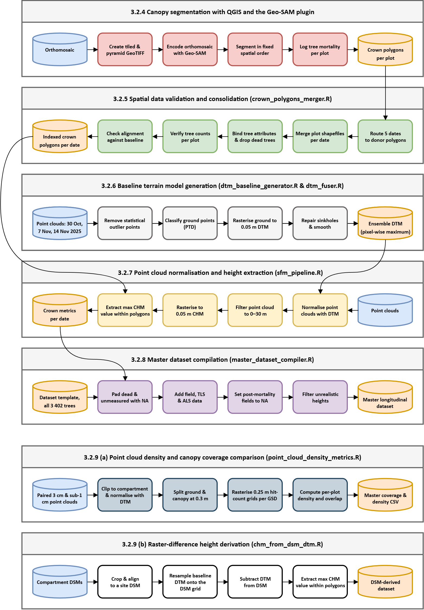

# EucVision — R processing pipeline

**Assessing weekly crown dynamics of juvenile *Eucalyptus* using high-resolution RGB UAV imagery**

Jacques Vermeulen · MSc Forestry, Stellenbosch University
IMPACT OAL trial, [eucxylo.sun.ac.za](https://eucxylo.sun.ac.za/)

---

## Overview

A modular workflow that turns raw Structure-from-Motion (SfM) point clouds and orthomosaics into individual-tree metrics for juvenile *Eucalyptus* stands. The pipeline normalises terrain against a temporally fused baseline DTM, derives canopy height models, extracts per-crown heights inside manually delineated crown polygons, and compiles a single longitudinal master dataset for statistical analysis.

Scripts are named by domain rather than numbered, so an alphabetical listing groups related work (`chm_*`, `dtm_*`, `timelapse_*`). Execution order is documented below rather than encoded in filenames.

## Pipeline overview



*The diagram above corresponds to Data processing workflow of the thesis. Editable source: `Diagrams/data_processing`.*

---

## Run order

### Stage 1 — Baseline terrain

Run once, then again only when a flight with better ground visibility becomes available.

| Script | Purpose |
|---|---|
| `dtm_baseline_generator.R` | Processes raw baseline point clouds site-wide in geometric chunks. Applies statistical outlier removal, classifies ground with Progressive TIN Densification beneath the canopy, fills morphological sinkholes, builds a master DTM VRT and crops it to the study boundary. Run individually on the dates with the best ground visibility. |
| `dtm_fuser.R` | Stacks the individual temporal DTMs from the previous step and takes the pixel-wise maximum, overwriting transient SfM sinkholes to produce the single baseline DTM used by everything downstream. |

### Stage 2 — Per-flight processing

Run for each new flight date.

| Script | Purpose |
|---|---|
| `crown_polygons_merger.R` | The bridge between manual QGIS crown delineation and the automated pipeline. Batch-merges per-plot shapefiles into one spatial dataframe, binds them to the master CSV template, applies temporal mortality filtering, enforces CRS stability and runs QA/QC failsafes against geometry-count mismatches and coordinate reversal. **Run after delineating crowns for a new flight.** |
| `sfm_pipeline.R` | **The main workflow.** Clips point clouds to plot boundaries, normalises height against the baseline DTM, generates CHMs and extracts the per-crown maximum heights used throughout the thesis. Uses `future` parallelism — check RAM and cooling before large batches. |
| `master_dataset_compiler.R` | Aggregates plot-level crown metrics across every processed flight, joins them to the field measurements, pads dead and unmeasured trees from the master template so mortality is explicit rather than missing, applies outlier filtering (99th percentile + 5 m) and writes `01. Master Dataset.csv`. |

`01. Master Dataset.csv` is the handover point to the Python analysis (see `../Python`).

### Stage 3 — Statistics

| Script | Purpose |
|---|---|
| `gamm_statistics.R` | Fits the three combined GAMMs (calibrated height, crown area, CA:H ratio) with `bam()`, `method="fREML"`, `discrete=TRUE`. Two-stage variance-weighted refit, Duan smearing back-transformation for the log-scale responses, and covariance-aware delta-method pairwise contrasts on a 300-point day grid. Writes the statistics tables and all Part II figures. Input: `01. Data Analysis/UAV_Master_Dataset_25-05-2026.csv`. |

### Alternative extraction methods

These sit outside the main sequence. Each produces heights by a different route, and the comparison between them is what Table 3.3 reports.

| Script | Purpose |
|---|---|
| `chm_from_dsm_dtm.R` | **Comparison arm for Table 3.3.** Mosaics masked Pix4D DSMs and subtracts the baseline DTM by raster maths, instead of normalising the point cloud. Self-contained: it repeats the aggregation, field-data join and outlier filtering internally so the whole comparison runs as one batch, and writes its own parallel master dataset. |
| `chm_pipeline_dtm_independent.R` | **TLS and ALS processing.** Classifies ground and builds a DTM from each dataset's own point cloud rather than using the site baseline, then normalises, generates CHMs and extracts heights. This is how the TLS and ALS reference heights are produced. |
| `chm_height_extraction.R` | Standalone re-extraction of per-crown heights from existing CHMs, without regenerating the point clouds. Useful when only the crown polygons have changed. |

### Supporting utilities

| Script | Purpose |
|---|---|
| `point_cloud_density_metrics.R` | Generates 0.25 m ground and canopy hit-count rasters, then extracts plot area, point counts, planar densities and sub-1 cm percentage coverage via Boolean overlay. Feeds the flight-quality and coverage results. |
| `tls_las_converter.R` | Preprocesses raw TLS `.laz` scans: applies the X/Y coordinate inversion needed for the Lo19 axis order, re-headers, and exports uncompressed `.las` named to the pipeline's convention. Run before `chm_pipeline_dtm_independent.R` on TLS data. |

### Visualisation and QA

| Script | Purpose |
|---|---|
| `plot_visualiser.R` | Interactive 3D QA sandbox (`rgl`). Renders raw, ground-classified and normalised clouds for a chosen plot and date alongside its CHM. Includes optional local-maximum-filter and Dalponte segmentation routines for testing individual tree detection. |
| `chm_maps.R` | Publication cartography. Applies focal smoothing to reduce raster noise, then renders top-down CHM maps with `ggplot2`/`tidyterra` — viridis scaling, north arrow, scale bar. |
| `timelapse_generator.R` | Builds MP4 animations from chronologically sorted orthomosaics, cropped to a target extent, with static plot boundaries and species-coloured crown polygons overlaid. |
| `timelapse_generator_wilo.R` | Heat-map animation of daily maximum soil temperature from the Wilo sensor CSV, overlaid on the merged orthomosaic. |

---

## Conventions

**Coordinate reference system.** Everything is EPSG:2048 (Hartebeesthoek94 / Lo19), whose axis order is southing–westing. Several scripts hard-code the exact OGC WKT string as `pure_epsg_2048_wkt` and re-stamp `.prj` files after writing, because GDAL and QGIS otherwise silently reorder the axes. Do not replace this with `st_crs(2048)`.

**Batch control.** Most per-flight scripts share the same two switches near the top:

```r
target_date_override <- "20. 23 March 2026"  # NULL runs the full batch
exclude_list <- c("000. Projects", "00. Baseline DTM", ...)
```

**Folder naming.** Flight folders are `NN. DD Month YYYY`, optionally suffixed (`(ALS)`, `(TLS)`, `(Multispectral)`, `Oblique`). Scripts parse the `NN. ` prefix off and convert spaces to underscores for output filenames. Renaming a flight folder will break the batch scan.

**Per-date subfolders.** `01. Orthomosaics`, `03. Point Clouds`, `04. Point Clouds Clipped`, `05. Point Clouds Ground Classified`, `06. Point Clouds Normalised`, `07. Canopy Height Models`, `08. Crown Polygons`, `09. Crown Metrics`.

**Locale.** Scripts that parse dates call `Sys.setlocale("LC_TIME", "C")` so month names resolve consistently.

---

## Requirements

R with: `lidR`, `RCSF`, `RMCC`, `terra`, `sf`, `exactextractr`, `gstat`, `geometry`, `sp`, `future`, `dplyr`, `readr`, `stringr`, `tictoc`, `mgcv`, `gratia`, `tidyverse`, `patchwork`, `ggrepel`, `multcompView`, `ggplot2`, `ggspatial`, `tidyterra`, `rgl`, `magick`, `av`, `lubridate`.

Developed on 32 GB RAM with `plan(multisession, workers = 6)`. Lower the worker count on smaller machines — the chunk sizes in `dtm_baseline_generator.R` are tuned to that configuration.

`timelapse_*.R` require FFmpeg via the `av` package.

---

## Notes and limitations

- **Paths are absolute and machine-specific.** Every script hard-codes `E:/Remote Sensing Media` or a OneDrive path. Running elsewhere means editing the configuration block at the top of each file.
- **Two master datasets exist by design.** `master_dataset_compiler.R` writes the primary `01. Master Dataset.csv` from the `sfm_pipeline.R` outputs; `chm_from_dsm_dtm.R` writes a separate `Master Dataset_RasterMath.csv` for the Table 3.3 comparison. They are not interchangeable, and the shared join and filtering logic is duplicated deliberately so each runs standalone.
- **Two dated master exports exist.** `UAV_Master_Dataset_25-05-2026.csv` is the
  study-scope dataset — 25 May 2026 is the cutoff for the longitudinal analysis,
  and it is what `gamm_statistics.R` and all Part II results use.
  `UAV_Master_Dataset_26-06-2026.csv` extends past the cutoff for the ALS
  comparison only, and is not used for the growth modelling.
- **Package versions are not pinned.** Results depend on `mgcv` and `lidR` versions in particular.
