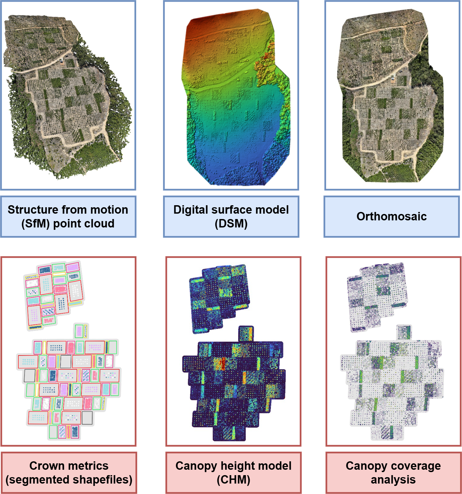

# EucVision

UAV-based remote sensing study of juvenile *Eucalyptus* plantation trials, developed as part of an MSc Forestry thesis at Stellenbosch University.

Jacques Vermeulen · Department of Forestry and Wood Science, Stellenbosch University

*Data products behind the study. Top row (blue): photogrammetric products received from Integrated Aerial Systems — the Structure-from-Motion point cloud, digital surface model and orthomosaic. Bottom row (red): products derived in this study — segmented crown shapefiles, plot-level canopy height models, and the canopy coverage and point density analysis.*

## Site

Trial site: IMPACT OAL, near Stellenbosch, South Africa ([eucxylo.sun.ac.za](https://eucxylo.sun.ac.za)).

Five *Eucalyptus* species and clones are monitored — *E. grandis* seedling, an *E. grandis* clone, *E. urophylla*, *E. cloeziana* and *E. cladocalyx* — across four planting spacings (1×1 m, 2×2 m, 3×3 m, 5×5 m) with three plot replicates each, plus mixed-species plots. The study tracks 3 144 planted trees across 69 plots. Repeated DJI Matrice 3D flights from a DJI Dock 2 provide the imagery and point clouds underlying the analysis.

## Methods summary

**Acquisition.** Near-weekly BVLOS flights, 31 October 2025 to 25 May 2026 — 92 individual flights across 25 flight dates, extended backwards by two ad hoc flights (February 2025, September 2025). From 23 March 2026 each date flies two concurrent configurations: a sub-1 cm GSD pass at 25 m AGL for orthomosaics, and a 3 cm GSD cross-hatch pass at 111 m AGL for height extraction. Six ground control points, three per compartment. Imagery is processed to point clouds, DSMs and orthomosaics in Pix4Dmapper by Integrated Aerial Systems.

**Processing (`R/`).** Crowns are delineated per plot in QGIS, then merged and validated in R. A baseline terrain model is fused from three flights with good ground visibility and reused throughout; per-flight point clouds are normalised against it, converted to canopy height models, and the maximum height inside each crown polygon is extracted. Everything is compiled into one longitudinal dataset covering every tree on every date, with mortality carried explicitly rather than as missing rows.

**Analysis (`Python/` and `R/`).** UAV heights are calibrated per species against three reference epochs — terrestrial laser scanning, field measurement and airborne laser scanning — and validated by cross-validation against all three. Stand density, canopy closure and allocation metrics are derived from the calibrated series. Growth is modelled with generalised additive mixed models (`mgcv::bam`) for height, crown area and the crown area–to–height ratio, with variance weighting, Duan smearing back-transformation and delta-method pairwise contrasts.

All coordinates are EPSG:2048 (Hartebeesthoek94 / Lo19).

## Repository structure

- **[`R/`](R/)** — the processing pipeline: terrain modelling, point cloud normalisation, canopy height extraction, master dataset compilation, and the GAMM growth models. See [`R/README.md`](R/README.md) for run order and per-script detail.
- **[`Python/`](Python/)** — the analysis notebook producing most thesis figures and tables, the Pix4D report extractor, and experimental crown-delineation work. See [`Python/README.md`](Python/README.md).
- **`Diagrams/`** — workflow figures used in the thesis, as draw.io sources and exports.

The handover point between the two is the master longitudinal dataset: R produces it, Python analyses it.

## Data availability

Imagery and derived datasets are archived at the Information Hub, a Google Cloud Platform store maintained with the University of Pretoria, under the project *IMPACT regular drone-in-a-box imagery and derived datasets*.

The scripts here reference absolute local paths and will not run unmodified elsewhere. They are published for transparency and method review rather than as a turnkey pipeline.

## Status

Active — this repository supports an MSc thesis currently in preparation. Code and structure may change as the analysis is finalised.

## Citation

If referencing this work, please cite the associated thesis (details to follow on submission) alongside this repository.

## Acknowledgements

Funded by the Hans Merensky Legacy Foundation. Flight operations and photogrammetric processing by Integrated Aerial Systems.
